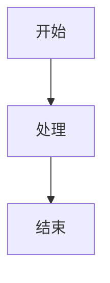
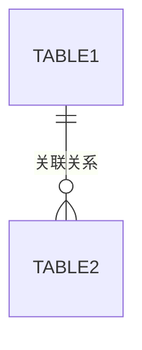
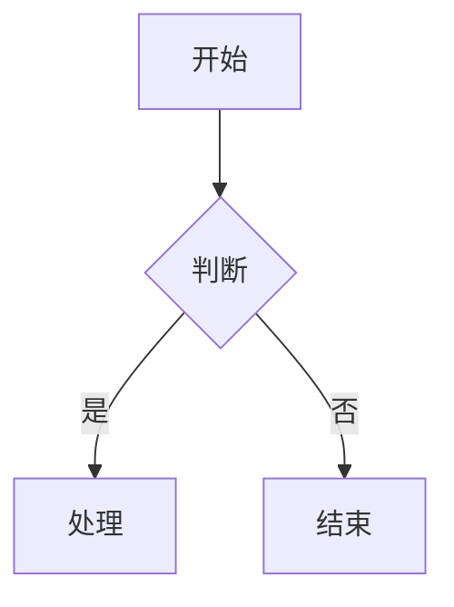

# Obsidian 文档输出规范

本技能定义了所有技术文档的输出规范，确保文档统一输出到 Obsidian Vault 并符合 Obsidian 的最佳实践。

## 核心原则

1. **统一输出路径**：所有文档输出到 `C:\Users\20301\Documents\Obsidian Vault\文档\`。写入优先使用 mcp-obsidian 工具（`obsidian_write_note`/`obsidian_append_to_note`/`obsidian_patch_note`，路径用 vault 相对路径如 `文档/设计文档/xx.md`）；工具不可用时再直接写文件系统。
2. **大类+子目录分类**：按文档类型建立一级目录，大需求建立二级子目录
3. **Obsidian 原生特性**：使用 `[[双向链接]]`、`#标签`、Callout 块等特性
4. **固定模板**：每种文档类型有对应的标准模板，保证结构一致

## 目录结构规范

```
C:\Users\20301\Documents\Obsidian Vault\文档\
├── 设计文档/                  # 系统设计、方案设计、架构设计
│   ├── 排柜系统/              # 大需求子目录
│   │   ├── 排柜系统-总体设计.md
│   │   ├── 排柜系统-排柜引擎设计.md
│   │   └── 排柜系统-需求池设计.md
│   └── 地区信息-设计文档.md   # 小需求直接放文件
├── 接口文档/                  # 本系统 RESTful API 接口文档
│   └── 地区表-sys_region-接口文档.md
├── 第三方平台接口文档/        # 第三方平台(领星/亚马逊/Wayfair/Mirakl等)接口说明
│   └── 领星-FBA库存明细-接口文档.md
├── ERD文档/                   # 实体关系图、数据模型、ODS/分层架构设计
│   └── 销售老主体库存计算/    # 大需求子目录
│       └── 销售老主体库存计算-ERD与ODS设计.md
├── 表设计文档/                # 单表/多表 DDL 设计
│   └── sys_region-表设计.md
├── 流程图文档/                # 流程图、时序图、状态机
│   └── 排柜系统/
│       └── 排柜系统-业务流程.md
├── 测试文档/                  # 功能测试、联调测试、验证计划
│   └── xhthome-OSS测试接口文档.md
├── 迭代文档/                  # 需求迭代、改动点汇总、版本变更记录
│   └── 捆绑产品合箱规则迭代.md
└── 其他文档/                  # 不归属上述分类(账号/环境/操作手册/规范)
```

> [!warning] 接口文档 vs 第三方平台接口文档
> `接口文档/` 收**本系统对外/对内的 RESTful API**（Controller 层）。
> `第三方平台接口文档/` 收**对接的第三方平台 OpenAPI 说明**（领星、亚马逊、Wayfair、Mirakl 等外部接口的字段/调用方式）。
> 二者性质不同，不可混放。

### 分类判断规则

| 文档内容 | 一级目录 | 文件命名格式 |
|----------|----------|-------------|
| 系统/模块/方案的整体设计思路、架构决策 | `设计文档/` | `{系统名}-{主题}-设计文档.md` |
| 本系统 RESTful API 接口定义、请求响应格式 | `接口文档/` | `{模块名}-接口文档.md` |
| 第三方平台 OpenAPI 说明、外部接口字段/调用方式 | `第三方平台接口文档/` | `{平台名}-{接口名}-接口文档.md` |
| 实体关系图、表关联、数据模型全景、ODS/分层架构、库存计算规则 | `ERD文档/` | `{系统名/需求名}-ERD{与...}.md` |
| 单表 DDL、字段说明、索引设计 | `表设计文档/` | `{表名}-表设计.md` |
| 流程图、时序图、状态机图（Mermaid） | `流程图文档/` | `{系统名}-{流程名}.md` |
| 功能测试计划、接口验证、联调测试用例、测试步骤与预期结果 | `测试文档/` | `{系统名}-{模块}测试文档.md` |
| 需求迭代、改动点汇总、版本变更记录、合箱规则迭代 | `迭代文档/` | `{系统名}-{迭代主题}迭代.md` |
| 环境配置、账号信息、操作手册、研发规范 | `其他文档/` | `{主题}.md` |

> [!warning] 严禁"一文多类"
> 一份文档只能归属一个一级目录。若发现某文档同时包含"设计+接口"或"设计+DDL+流程图"等多类内容（如历史遗留的"xx-设计文档及接口文档"），**必须按内容拆分为多份文档**分别归入对应目录，并用双向链接互相引用。ERD 文档例外：ERD 可合法包含 ODS/分层架构/ER 图/计算规则（同属"数据模型"范畴），但仍应把单表 DDL 抽到 `表设计文档/`、流程抽到 `流程图文档/`。

### 大需求判断标准

满足以下**任一**条件，在对应一级目录下创建子目录：
- 该需求涉及 3 个及以上文档
- 该需求是一个独立的项目/模块（如"排柜系统"、"对账模块"）
- 用户明确要求创建子目录

子目录命名：`{需求名称}/`，使用中文，简洁明了。

## Obsidian 特性使用规范

### 1. 双向链接 `[[]]`

在文档中**主动链接**相关文档，建立知识图谱：

```markdown
## 相关文档
- 接口定义详见 [[地区表-sys_region-接口文档|地区表接口文档]]
- 数据库设计参考 [[sys_region-表设计|sys_region 表设计]]
- 整体架构见 [[畅泰云-架构设计|畅泰云架构设计]]
```

规则：
- **使用文件名（最短路径）**：`[[文件名]]` 或 `[[文件名|显示文本]]`，Obsidian 会自动按文件名解析，**不要用** `../` 相对路径（移动文件后相对路径会断链）
- 同名文件消歧：若 Vault 内有同名文件，用 `[[目录名/文件名]]` 消歧（如 `[[排柜系统/排柜系统-总体设计]]`）
- 可加别名：`[[文件名|显示文本]]`
- 每个文档**必须**包含"相关文档"章节，至少链接 1-2 个关联文档

### 2. 标签 `#标签`

每个文档末尾必须添加标签行，格式：

```markdown
---
**标签**：#设计文档 #排柜系统 #sys_region #接口文档
```

标签规则：
- 使用中文技术标签，具体明确
- 第一个标签为文档类型（如 `#设计文档` `#接口文档` `#ERD文档` `#测试文档`）
- 之后为系统/模块名、表名、技术关键词
- 标签数量：3-8 个

### 3. Callout 块

用于突出关键信息：

```markdown
> [!note] 设计要点
> 这里记录关键设计决策

> [!warning] 注意事项
> 这里记录需要注意的风险点

> [!tip] 最佳实践
> 这里记录推荐做法

> [!info] 版本信息
> - 创建时间：2026-06-05
> - 作者：AI 生成
> - 关联需求：排柜系统一期
```

### 4. Mermaid 图表

流程图、ERD、时序图等使用 Mermaid 语法：

```markdown

```

> [!warning] Mermaid 11.x 兼容性规则（Obsidian 2025.1+ 已升级至 Mermaid 11.x）
> Obsidian 的 Markdown 预解析器会在 Mermaid 引擎渲染前，**先扫描双引号 `""` 内的纯文本**。以下模式会触发预解析器误判，导致 `Unsupported markdown: list` 错误，图表无法渲染：
>
> | ❌ 禁止写法 | ✅ 正确写法 | 原因 |
> |------------|------------|------|
> | `["1. 步骤一"]` | `["①步骤一"]` 或 `["1.步骤一"]` | `数字.空格` 被误判为有序列表 |
> | `["2. 步骤二"]` | `["②步骤二"]` 或 `["2.步骤二"]` | 同上 |
> | `["- [ ] 待办"]` | `["\[ ] 待办"]` 或 `["\- [ ] 待办"]` | `- [ ]` 被误判为任务列表 |
>
> **核心规则：Mermaid 双引号内，绝对不要写 `数字. `（数字+英文句号+空格），这是触发 `Unsupported markdown: list` 的唯一根源。**
>
> 推荐做法：
> - 序号用中文圈号 `①②③④⑤⑥`（最稳妥，无歧义）
> - 或写 `数字.内容`（无空格，如 `1.加载字典`）
> - 换行用 `<br>` 代替 `\n`（Mermaid 标准换行，兼容性更好）
> - `flowchart` 关键字可用 `graph` 替代（兼容低版本 Obsidian）
> - 节点文本中的 `/`、`_` 等字符在双引号内通常安全，无需转义

## 文档模板

### 设计文档模板

```markdown
# {系统/模块名} - {主题}设计文档

> [!info] 文档信息
> - 创建时间：{YYYY-MM-DD}
> - 关联需求：{需求名称}
> - 关联模块：{模块路径}

## 一、背景与目标

## 二、整体方案

## 三、详细设计

## 四、关键决策与权衡

## 五、相关文档
- [[{接口文档名}|{接口文档名}]]]
- [[{表设计文档名}|{表设计文档名}]]]

---
**标签**：#设计文档 #{系统名} #{模块名}
```

### 接口文档模板

```markdown
# {模块名} - 接口文档

> [!info] 文档信息
> - 创建时间：{YYYY-MM-DD}
> - 基础路径：`/{base-path}`
> - 关联模块：{模块路径}

## 一、接口总览

| 序号 | 接口 | 方法 | 路径 | 说明 | 请求参数 | 返回值 | 权限标识 |
|------|------|------|------|------|----------|--------|----------|

## 二、核心 DTO/VO 定义

### 2.1 请求 DTO

#### {DTO类名}

| 字段 | 类型 | 必填 | 校验规则 | 说明 |
|------|------|------|----------|------|

### 2.2 响应 VO

#### {VO类名}

| 字段 | 类型 | 说明 |
|------|------|------|

## 三、接口详细说明

### 接口1：{接口名称}

**`{METHOD} {URL}`**

**请求参数**：
| 参数 | 类型 | 必填 | 默认值 | 说明 |
|------|------|------|--------|------|

**请求示例**：

```json
{}
```

**响应示例**：

```json
{}
```

**响应字段说明**：

| 字段 | 类型 | 说明 |
|------|------|------|

**业务规则**：
1. 规则描述

## 四、错误码说明

| 错误场景 | 说明 |
|----------|------|

## 五、相关文档
- [[{设计文档名}|{设计文档名}]]]

---
**标签**：#接口文档 #{模块名} #API
```

### ERD文档模板

```markdown
# {系统名} - 实体关系图

> [!info] 文档信息
> - 创建时间：{YYYY-MM-DD}
> - 数据库：{数据库名}

## 一、ER 图



## 二、核心实体说明

## 三、表关联矩阵

| 源表 | 目标表 | 关联字段 | 关系类型 | 说明 |
|------|--------|----------|----------|------|

## 四、相关文档
- [[{表名}-表设计|{表名}表设计]]]

---
**标签**：#ERD文档 #{系统名} #数据模型
```

### 表设计文档模板

```markdown
# {表名} - 表设计文档

## 一、建表 DDL

```sql
CREATE TABLE `{表名}` (
  ...
) ENGINE=InnoDB DEFAULT CHARSET=utf8mb4 COMMENT='{表注释}';
```

## 二、字段说明

| 字段名 | 类型 | 必填 | 默认值 | 说明 |
|--------|------|------|--------|------|

## 三、索引设计

| 索引名 | 类型 | 字段 | 用途说明 |
|--------|------|------|----------|

## 四、关联关系

## 五、相关文档
- [[{设计文档名}|{设计文档名}]]]

---
**标签**：#表设计文档 #{表名} #{系统名}
```

### 流程图文档模板

```markdown
# {系统名} - {流程名}流程

> [!info] 文档信息
> - 创建时间：{YYYY-MM-DD}
> - 关联系统：{系统名}

## 一、流程图



## 二、流程说明

## 三、关键节点说明

| 节点 | 说明 | 涉及服务/表 |

## 四、相关文档

---
**标签**：#流程图文档 #{系统名} #{流程名}
```

### 测试文档模板

```markdown
# {系统/模块名} - {测试主题}测试文档

> [!info] 文档信息
> - 创建时间：{YYYY-MM-DD}
> - 基础路径：`/{base-path}`
> - 关联模块：{模块路径}
> - Controller：`{全限定类名}`

## 一、测试目标

说明本次测试要验证的核心功能和范围。

## 二、前置条件

> [!warning] 必读
> 列出运行测试前必须完成的配置和准备工作：

```yaml
# 必需的配置文件或环境变量示例
```

> [!note] 配置检查清单
> - [ ] 配置项1
> - [ ] 配置项2

## 三、接口清单

| 序号 | 接口名称 | 方法 | 路径 | 说明 | Content-Type |
|------|----------|------|------|------|-------------|
| 1 | {接口名} | GET/POST/PUT/DELETE | `/api/xxx` | {功能说明} | {Content-Type} |

## 四、响应结构说明

### 4.1 统一响应格式

```json
{
  "code": 10000,
  "message": "Success",
  "data": {},
  "timestamp": 1782790000000
}
```

### 4.2 核心响应对象字段

| 字段 | 类型 | 说明 |
|------|------|------|

## 五、测试用例

### 用例 1：{用例名称}

**测试接口**：`{METHOD} {URL}`

**请求参数**：

| 参数 | 类型 | 必填 | 默认值 | 说明 |
|------|------|------|--------|------|

**请求示例**：

```bash
curl ...
```

**预期响应**：

```json
{}
```

**验证点**：
- 验证项1

---

### 用例 N：{用例名称}

（按需复制上述结构）

## 六、完整测试流程

将全部用例串联为一个端到端的自动化测试脚本：

```bash
# 1. 第一步操作
curl ...

# 2. 第二步操作
curl ...

# N. 清理
curl ...
```

## 七、响应码说明

| code | 场景 | 说明 |
|------|------|------|
| 10000 | 成功 | 操作正常完成 |
| 20001 | 业务错误 | {具体场景} |
| 50000 | 系统错误 | {具体场景} |

## 八、相关文档

- [[{设计文档名}|{设计文档名}]]]
- [[{接口文档名}|{接口文档名}]]]

---
**标签**：#测试文档 #{系统名} #{模块名} #{测试类型}
```

测试文档模板的使用要点：

- **测试目标**要聚焦，说清楚测什么、不测什么
- **前置条件**要可执行，带具体的配置文件和 checklist
- **接口清单**是整个文档的索引，方便快速定位
- **测试用例**编号清晰，每个用例包含完整的请求示例和预期响应
- **验证点**要明确，让读者知道什么是正确行为
- **完整测试流程**把所有用例串成一条自动化脚本，可直接复制粘贴执行
- 如果只是某个接口的简单验证（不需要章节化结构），可以走接口文档模板，不强制归入测试文档

## 输出流程

1. **判断文档类型**：根据内容确定属于哪个大类
2. **判断是否需要子目录**：大需求创建子目录，小需求直接放文件
3. **确保目录存在**：如目录不存在，先创建
4. **使用对应模板**：按模板结构填充内容
5. **添加 Obsidian 特性**：双向链接、标签、Callout 块
6. **写入文件**：优先用 mcp-obsidian 工具（`obsidian_write_note`，target 用 vault 相对路径 `文档/{一级目录}/{文件名}.md`），MCP 不可用时再用完整绝对路径写文件系统

## 已有文档重组

当用户要求重组已有文档，或首次启用此技能时，按以下步骤执行：

1. 扫描 `C:\Users\20301\Documents\Obsidian Vault\文档\` 下的所有 `.md` 文件
2. 根据内容判断每个文档的类型
3. 创建对应的一级目录和子目录
4. 将文件移动到对应目录
5. 为每个文件添加标签行（如果缺失）
6. 更新文档间的双向链接引用

### 删除/归档文档前安全检查

**必须**在删除或归档任何文档前执行以下检查，防止误删导致知识图谱断链：

1. **引用检查**：在 Vault 内 grep 目标文件名，确认无其他文档用 `[[]]` 链接引用它。有引用的文档不可直接删除，须先更新引用方。
2. **取代检查**：确认目标文档的内容已被新文档完整覆盖（读取新旧文档头部/关键章节对比）。
3. **安全检查**：若文档含明文密钥/Token/密码，**优先删除**（无论引用状态），并通知用户轮换泄露的凭据。
4. **确认机制**：列出候选删除清单（含理由），向用户确认后方可执行删除。不可自行决定删除。